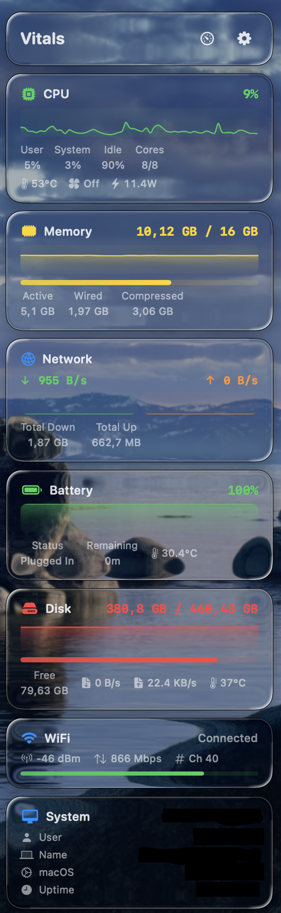
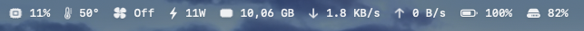
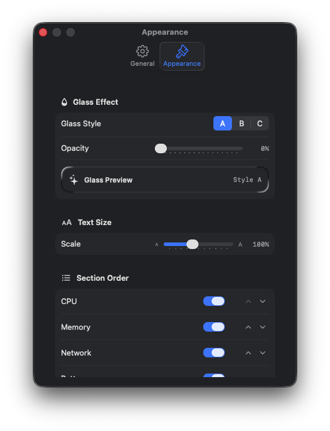
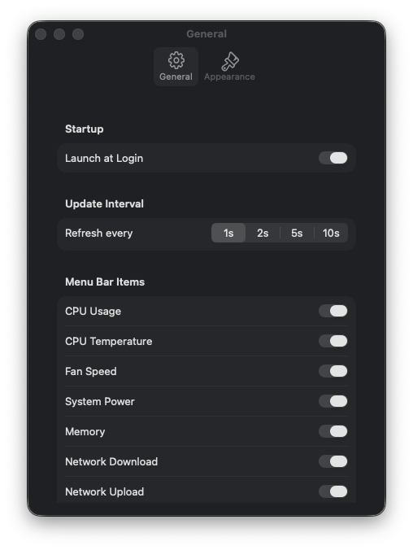

# Vitals

A lightweight macOS menu bar app that monitors your system in real time with a beautiful Liquid Glass interface.

Built with SwiftUI and designed for **macOS 26 (Tahoe)**.

**Current version: 2.0** — See [CHANGELOG.md](CHANGELOG.md) for full release history.

## Features

- **Menu Bar** — Live CPU, GPU, memory, network, battery, disk stats right in your menu bar
- **Liquid Glass UI** — Native `NSGlassEffectView` with 3 style variants and adjustable opacity
- **CPU** — Usage breakdown (user/system/idle), core count, temperature, fan RPM, power draw
- **GPU** — Utilization, VRAM usage, temperature (Apple Silicon + Intel/AMD)
- **Memory** — Used/total with active, wired, and compressed breakdown
- **Network** — Live upload/download speeds with sparkline graphs and total transfer stats
- **Battery** — Charge level, health %, cycle count, charging status, time remaining, temperature
- **Disk** — Usage bar, free space, read/write speeds, SSD temperature
- **WiFi** — Connection status, signal strength, link speed, channel, local IP, public IP
- **System Info** — Computer name, user, macOS version, uptime
- **Desktop Widgets** — System Health, Storage, Battery, Network Info
- **Customizable** — Reorder sections and menu bar items, toggle visibility, adjust text size, choose glass style

## Screenshots

### Popover


### Menu Bar


### Settings - Appearance


### Settings - General


## What's New in v2.0

- GPU monitoring (utilization, VRAM, temperature)
- Battery health tracking (capacity degradation, cycle count)
- Local & Public IP addresses
- Desktop widgets (System Health, Storage, Battery, Network Info)
- Menu bar item reordering with arrow buttons
- Native `NSGlassEffectView` for authentic Liquid Glass
- Light/dark mode adaptive glass opacity
- Scrollable popover for smaller screens

See [CHANGELOG.md](CHANGELOG.md) for the complete list of changes.

## Requirements

- macOS 26.0 (Tahoe) or later
- Xcode 26 with Swift 6.0

## Installation

### Build from source

1. Clone the repository:
   ```bash
   git clone https://github.com/filiphajduch420/Vitals.git
   cd Vitals
   ```

2. Install [XcodeGen](https://github.com/yonaskolb/XcodeGen) if you don't have it:
   ```bash
   brew install xcodegen
   ```

3. Generate the Xcode project and open it:
   ```bash
   xcodegen generate
   open Vitals.xcodeproj
   ```

4. Select the **Vitals** scheme, set your signing team, and hit **Run** (Cmd+R).

### Download release

Check the [Releases](https://github.com/filiphajduch420/Vitals/releases) page for pre-built `.dmg` downloads.

## Usage

After launching, Vitals lives in your menu bar. Click the menu bar items to open the popover with detailed system stats.

- **Settings** — Click the gear icon in the popover header
- **Glass Style** — Choose between 3 Liquid Glass variants (A, B, C) in Appearance settings
- **Opacity** — Adjust the glass darkness with the opacity slider
- **Section Order** — Reorder cards with the arrow buttons in Appearance settings
- **Menu Bar Order** — Reorder menu bar items with arrow buttons in General settings
- **Text Size** — Scale the UI from 80% to 130%
- **Widgets** — Add desktop widgets via Edit Widgets > Vitals

## Tech Stack

- **SwiftUI** — All UI
- **AppKit** — NSPanel for popover, NSGlassEffectView for Liquid Glass
- **CoreWLAN** — WiFi monitoring
- **IOKit** — Battery, GPU, and thermal data
- **Swift Charts** — Sparkline graphs
- **WidgetKit** — Desktop widgets
- **XcodeGen** — Project generation

## License

MIT License — see [LICENSE](LICENSE) for details.

## Author

Filip Hajduch ([@filiphajduch420](https://github.com/filiphajduch420))
